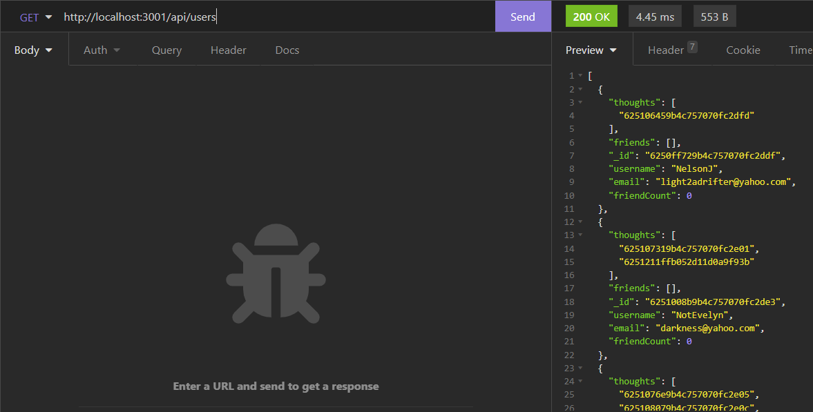

  <h1>In-Deep-Thought Social API</h1>

  
    
  

  
  ## Table of Contents
  -[Description](#description)  

  -[Installation](#installation)  

  -[Usage](#usage)  
  
  -[License](#license)  
  
  -[Contribution](#contribution)  

  -[Tests](#tests)  

  -[Questions](#questions)  

  ## Description

  The api for a social network, using standard CRUD.
  Video of it in action shown here: https://drive.google.com/file/d/1zDEs5DwDqLwKS_wcU9VAhknichMNj1hw/view!
  
  ## Installation
  npm install
  
  ## Usage
  npm start
  
  ## License
  
  This was created under the MIT license.
  
  
  ## Contribution
  No need to contribute.
  
  ## Tests
  N/A
  
  ## Questions
  
  Any questions, comments or concerns, reach out at light2adrifter@yahoo.com.

  Git hub available at: [light2adrifter](https://github.com/light2adrifter/in-deep-thought).

  

